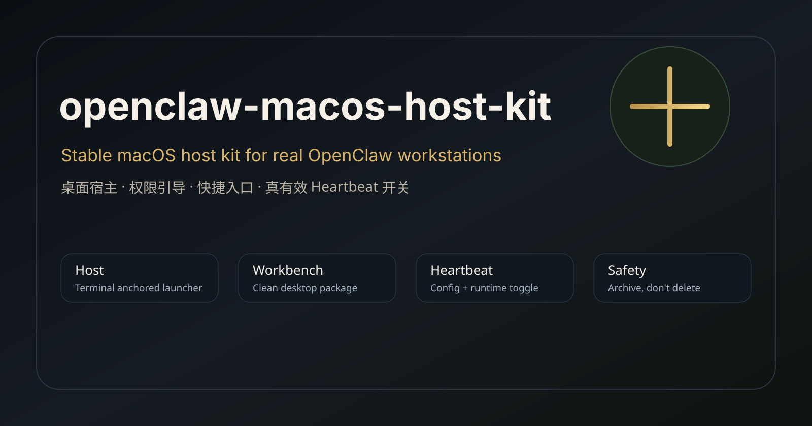

# openclaw-macos-host-kit

**一个经过真实机器验证的 OpenClaw skill，用来把 macOS 机器整理成稳定、清晰、可长期使用的 OpenClaw 工作机。**

[English](./README.md) | **中文**



`openclaw-macos-host-kit` 把真实部署 OpenClaw 时踩过的坑，整理成一套可复用工具：稳定宿主入口、桌面启动器、权限引导、干净的桌面工作台，以及真正有效的 Heartbeat 开关。

它不是理论模板，而是从真实多台 Mac 部署中抽出来的工作流。

## 为什么需要它

macOS 上跑 OpenClaw，问题往往不高级，但很消耗人：

- LaunchAgent 的环境变量刷新不一定符合直觉。
- macOS 隐私权限不能被脚本诚实地“静默授予”。
- 桌面快捷方式很容易堆成半失效命令垃圾场。
- “关闭 heartbeat” 看似成功，实际状态页仍然显示主 cadence 活着。

这个 skill 就是把这些坑收成标准件。

## 核心能力

- 创建稳定的 Terminal-hosted OpenClaw gateway 启动入口。
- 生成 `OpenClaw Host.command` 与可选 `OpenClaw Host.app`。
- 生成清晰的桌面 OpenClaw 工作台。
- 生成 macOS 权限收口入口。
- 生成真正有效的 Heartbeat 开关。
- 支持 full / host-only / desktop-only / heartbeat-only 模式。
- 支持 dry-run 与 JSON 输出，适合远程操作前预览。
- 支持安全归档旧桌面工作台，再生成新版。

## 它和普通快捷方式脚本不一样在哪

它不是装饰性桌面整理。

Heartbeat 开关使用经过验证的双层控制：

- 关闭：写入 `agents.defaults.heartbeat.every = ""`、`target = "none"`，再执行 `openclaw system heartbeat disable`
- 恢复：写入 `every = "30m"` 或指定节奏、`target = "none"`，再执行 `openclaw system heartbeat enable`

验收标准很明确：

- 关闭成功：`openclaw status --deep` 显示 `disabled (main)`
- 恢复成功：`openclaw status --deep` 显示 `30m (main)` 或你指定的节奏

## 边界

这个 skill **不会假装自动授予 macOS 隐私权限**。

它做的是：

- 提供稳定宿主方式
- 打开正确系统设置入口
- 生成桌面工具
- 给出验证脚本
- 让操作者知道该检查什么

## 安装

从 GitHub Release 下载 `.skill` 文件，安装到你的 OpenClaw skills 目录。

发布包位于：

```text
dist/openclaw-macos-host-kit.skill
```

## 基础用法

完整安装：

```bash
python3 skill/openclaw-macos-host-kit/scripts/install_host_kit.py --mode full --generate-app --json
```

先 dry-run：

```bash
python3 skill/openclaw-macos-host-kit/scripts/install_host_kit.py --dry-run --json
```

只生成 Heartbeat 开关：

```bash
python3 skill/openclaw-macos-host-kit/scripts/install_host_kit.py --mode heartbeat-only
```

安全替换旧工作台：

```bash
python3 skill/openclaw-macos-host-kit/scripts/install_host_kit.py \
  --replace-existing-worktable "OpenClaw Desk" \
  --mode full \
  --generate-app
```

旧工作台会归档，不会直接删除。

## 示例说法

- “把这台 Mac 配成稳定的 OpenClaw 工作机。”
- “生成一套干净的 OpenClaw 桌面工作台。”
- “做一个真正有效的 heartbeat 开关。”
- “把旧的 OpenClaw 桌面快捷方式安全迁移成新版。”
- “先 dry-run，不要直接动这台机器。”

## 版本状态

首个公开版本为 `v0.1.0`。它已经经过真实机器验证，但仍保守标记为初始公开版，后续会继续随着更多 macOS 机器验证迭代。

## 仓库结构

```text
skill/openclaw-macos-host-kit/   # skill 本体
dist/                            # 打包后的 .skill
releases/                        # release notes
assets/                          # banner / 图示资产
```

## License

MIT
